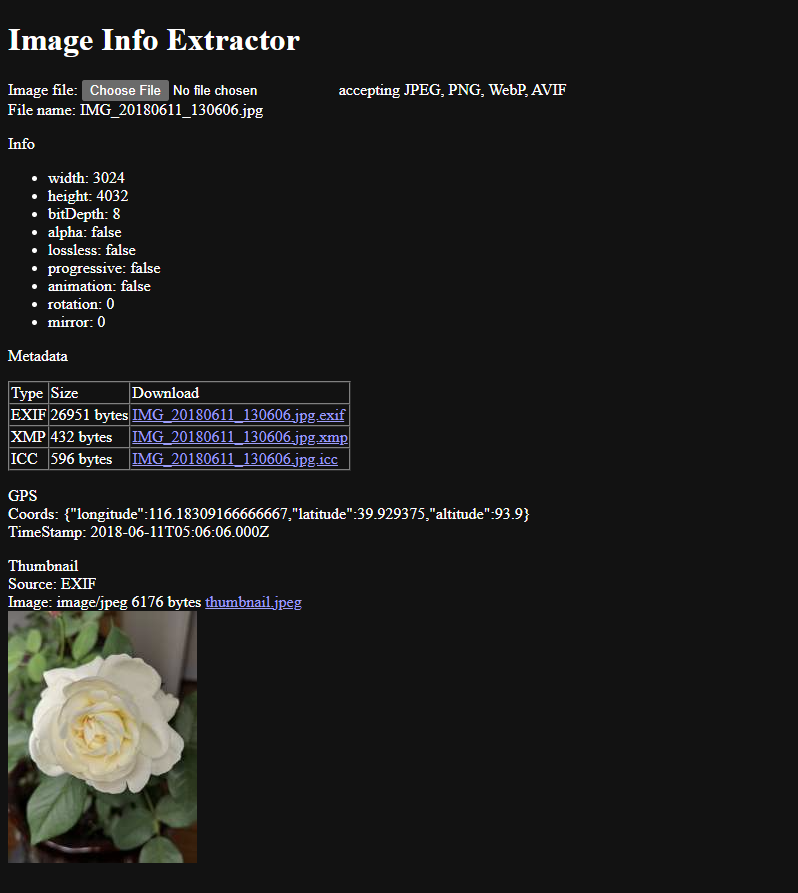
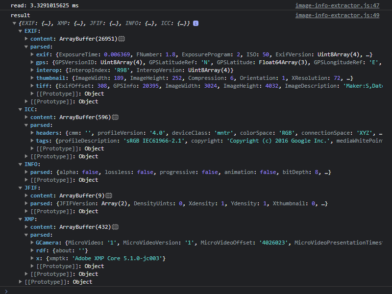

# Image Info Extractor

A JavaScript lib to read image info and to extract/parse image metadata.


> **Warning**
> This project is currently experimental.


## Features

This lib supports most web image formats: JPEG, PNG, WebP, AVIF, SVG.

### Image info reading

Image info reading support: width, height, alpha, bit depth, animation, lossless, rotation, mirror, progressive, grided

Note: the `width` and `height` are directly retrieved, you should also look at the `rotation` and `mirror` to render an image properly.

### Metadata extracting

Metadata extracting support: EXIF, XMP, ICC

Additional extracting support: JFIF, Extended XMP, IPTC for JPEG, XMP in SVG

Table 1: raster image metadata extracting support <small>(Y: yes, N: no)</small>


| Image format \\ Metadata format | EXIF | XMP  | ICC  |
| ------------------------------- | ---- | ---- | ---- |
| JPEG                            | Y    | Y    | Y    |
| PNG                             | Y    | Y    | Y    |
| WebP                            | Y    | Y    | Y    |
| AVIF                            | Y    | Y    | Y    |

### Metadata parsing

Metadata parsing support: EXIF 2.32, XMP 1.0, ICC 4.4

Optional support:

+ Vendor-specific XMP tag type mapping

TODOs:

+ Vendor-specific EXIF MakerNote parsing

### Data getters

+ Thumbnail data in EXIF
+ GPS info in EXIF
+ Date tags in EXIF







## Install

### Browser Requirements

+ Chromium 80
+ Firefox 113
+ Safari 16.4

### Install with NPM


```sh
npm install image-info-extractor
```


## Usage

```js
import {readFile, parseResult} from 'image-info-extractor';

// first, pick a file

// then pass the file to extractor
readFile(file).then(parseResult).then((result) => {
  console.log('result', result);
});
```

For detailed usage, see [image-info-extractor](examples/image-info-extractor.html) and [sidecar-file-viewer](examples/sidecar-file-viewer.html) under [examples/](examples/) 


## Related Efforts

This project is derived, with heavy modifications, from
+ https://github.com/titarenko/fast-exif
+ https://github.com/devongovett/exif-reader
+ https://github.com/lovell/icc


### License

[MIT](./LICENSE)

Copyright &copy; 2023 Fuwei Chin and others

